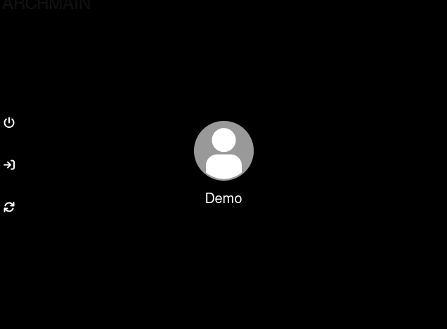
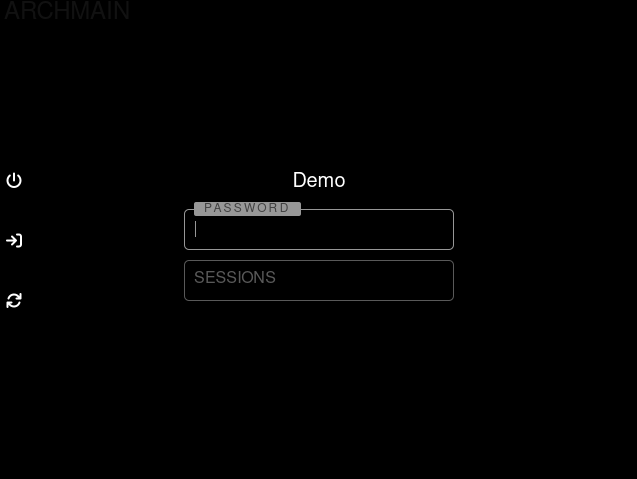

## lts - a lightdm webkit2 theme

A simple, modern, and lts lightdm webkit2 theme

## Demo
<p align='center'><br/><i>lts theme</i></p>

## Dependencies

+ lightdm
+ lightdm-webkit2-greeter

## Installation

0. If you're using `systemd`, make sure that `lightdm.service` is enabled and running.

1. Install it.

	+ Clone the repo
        ```
        git clone https://github.com/masDO1337/lightdm-webkit2-greeter-theme-lts.git
        ```
	+ Copy it to the lightdm-webkit theme folder:

		```sh
		sudo cp -r lightdm-webkit2-greeter-theme-lts /usr/share/lightdm-webkit/themes/lts
		```

3. Set lightdm greeter session to webkit2.

	```sh
	# Set default lightdm greeter to lightdm-webkit2-greeter
	sudo sed -i 's/^\(#?greeter\)-session\s*=\s*\(.*\)/greeter-session = lightdm-webkit2-greeter #\1/ #\2g' /etc/lightdm/lightdm.conf
	```

4. Set lightdm webkit2 greeter

	```sh
	# Set default lightdm-webkit2-greeter theme to lts
	sudo sed -i 's/^webkit_theme\s*=\s*\(.*\)/webkit_theme = lts #\1/g' /etc/lightdm/lightdm-webkit2-greeter.conf
	```
